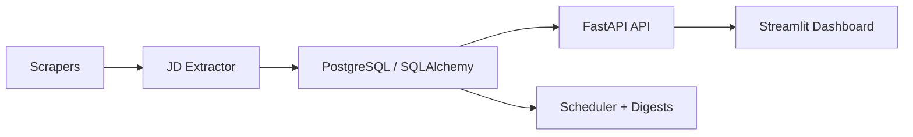

# SkillRadar

SkillRadar is an AI-powered job market intelligence platform for AI, ML, and data roles. It combines job scraping, structured skill extraction, weekly trend aggregation, resume gap analysis, and personalized learning roadmaps in one FastAPI plus Streamlit project.

The LLM layer now supports provider switching through one environment variable. You can run it against Groq or OpenRouter using OpenAI-compatible APIs, and keep OpenAI as an optional fallback.

## What It Does

SkillRadar collects job descriptions from public listing pages and normalizes the skills they ask for. Those signals are stored as weekly aggregates so the dashboard can show which skills are stable, which are accelerating, and where the market is shifting.

Users can upload a PDF or DOCX resume, or paste skills manually, to compare their background against current market demand. The backend scores market fit, highlights strengths and critical gaps, and turns missing skills into a phased roadmap with suggested resources.

The project also includes APScheduler-based background jobs, digest email plumbing, Docker deployment assets, an Alembic migration, demo seed scripts, and a pytest suite for core logic and API flows.

## LLM Provider Setup

Set `LLM_PROVIDER` in [`.env`](./.env) to one of:

- `groq`
- `openrouter`
- `openai`

Recommended defaults:

- Groq: `GROQ_MODEL=openai/gpt-oss-20b`
- OpenRouter: `OPENROUTER_MODEL=openrouter/free`

Example provider switch:

```bash
LLM_PROVIDER=groq
GROQ_API_KEY=your_groq_api_key_here
```

```bash
LLM_PROVIDER=openrouter
OPENROUTER_API_KEY=your_openrouter_api_key_here
OPENROUTER_MODEL=openrouter/free
```

## Architecture



## Quick Start

```bash
cd skillradar
python -m venv .venv
.venv\Scripts\activate
pip install -r requirements.txt
pip install -r requirements-dev.txt
python scripts/seed_sample_data.py --synthetic-only
uvicorn backend.main:app --reload
```

Run the dashboard from a second shell:

```bash
cd skillradar
pip install -r frontend/requirements.txt
streamlit run frontend/app.py
```

## Key Endpoints

- `POST /api/v1/scrape/trigger`
- `GET /api/v1/scrape/status`
- `GET /api/v1/skills/top`
- `GET /api/v1/skills/trend/{skill_name}`
- `GET /api/v1/skills/heatmap`
- `POST /api/v1/analyze/resume`
- `POST /api/v1/analyze/skills`
- `POST /api/v1/roadmap/{analysis_id}`
- `POST /api/v1/notifications/subscribe`

## Testing

```bash
pytest tests -v
```

## Notes

- `.env` is gitignored; `.env.example` shows the expected configuration.
- The backend falls back to deterministic heuristic extraction when no valid LLM provider key is configured.
- The scraper manager includes sample postings so the app remains demoable without live network access.
