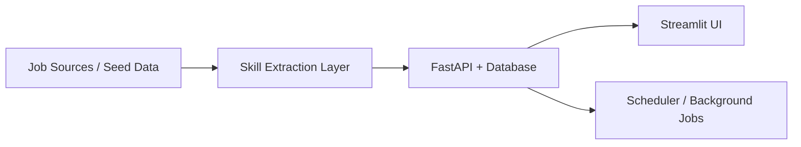

# SkillRadar

SkillRadar is a job market intelligence project for AI, ML, and data roles.

The idea is simple: instead of guessing what to learn next, the app looks at job descriptions, extracts the skills employers are asking for, tracks market demand over time, and compares that signal against a user's resume or skill set.

This repository is the **baseline MVP** version of the project. It currently uses:
- `FastAPI` for the backend
- `Streamlit` for the frontend
- `SQLite` for the easiest local demo setup
- `Groq` or `OpenRouter` for LLM-backed extraction flows

This repository now also includes a new `web/` folder with a `Next.js` frontend scaffold for the professional webapp migration and Vercel deployment path.

## What the app does

SkillRadar helps answer three useful questions:

1. What skills are showing up most often in AI and ML job postings?
2. How does my current profile compare to what the market is asking for?
3. If I have gaps, what should I learn next?

To support that flow, the app can:
- seed or scrape job market data
- simulate a realistic 12-week market snapshot across 10 tracked AI and data roles
- normalize and aggregate skill demand
- show trends in a dashboard
- analyze a resume or pasted skills
- generate a learning roadmap

## What works in this MVP

- local demo setup is quick
- market dashboard and skill explorer work
- recruiters can browse 10 role-specific views instead of a single generic market bucket
- resume analysis works with uploaded resumes or manual skills
- roadmap generation works
- test suite and lint checks pass
- LLM provider switching works through environment variables

## What is still prototype-grade

- the frontend is still Streamlit
- the default local database flow is SQLite
- scraping is good for demo and experimentation, not production-scale reliability
- some UX areas still need polish

That is intentional for this stage. The goal of this version is to serve as the working baseline before the project is migrated into a more production-style full-stack application.

## LLM setup

Set `LLM_PROVIDER` in [`.env`](./.env) to one of:
- `groq`
- `openrouter`
- `openai`

Recommended defaults:
- Groq: `GROQ_MODEL=openai/gpt-oss-20b`
- OpenRouter: `OPENROUTER_MODEL=openrouter/free`

Example:

```bash
LLM_PROVIDER=groq
GROQ_API_KEY=your_groq_api_key_here
```

Or:

```bash
LLM_PROVIDER=openrouter
OPENROUTER_API_KEY=your_openrouter_api_key_here
OPENROUTER_MODEL=openrouter/free
```

If no valid LLM key is configured, the backend falls back to deterministic heuristic extraction so the app is still demoable.

## Architecture



## Quick start

From the project root:

```bash
cd C:\Users\yashh\Skillradar
python -m venv venv
venv\Scripts\activate
pip install -r requirements.txt
pip install -r requirements-dev.txt
pip install -r frontend/requirements.txt
```

Seed demo data:

```bash
python scripts/seed_sample_data.py --synthetic-only
```

That command now loads a **curated 12-week market snapshot** across:
- AI Engineer
- ML Engineer
- LLM Engineer
- Data Scientist
- MLOps Engineer
- Data Engineer
- Analytics Engineer
- Computer Vision Engineer
- NLP Engineer
- Applied Scientist

Start the backend:

```bash
uvicorn backend.main:app --reload
```

Start the frontend in a second terminal:

```bash
cd C:\Users\yashh\Skillradar
venv\Scripts\activate
streamlit run frontend/app.py
```

Open:
- `http://127.0.0.1:8000/docs`
- `http://localhost:8501`

## New web frontend

If you want the more professional webapp version, use the new `web/` frontend:

```bash
cd C:\Users\yashh\Skillradar\web
copy .env.local.example .env.local
npm install
npm run dev
```

By default it expects:

```bash
NEXT_PUBLIC_API_BASE_URL=http://localhost:8000
```

Then open:
- `http://localhost:3000`

This new frontend is the recommended path for a Vercel-hosted recruiter demo. The backend should still be hosted separately.

## Demo data vs real data

If you run:

```bash
python scripts/seed_sample_data.py --synthetic-only
```

then the charts and explorer use a **curated role-based market snapshot** built to feel realistic for demos and portfolio review.

If you run the scrape pipeline and aggregation flow, the database can contain **real scraped data** or a mix of real and seeded data, depending on what you have already loaded.

## Public demo note

At this stage, the product has two frontend paths:
- `frontend/` for the current Streamlit MVP
- `web/` for the newer `Next.js` frontend that is better suited for Vercel

Recommended public deployment split:
- `web/` on Vercel
- `backend/` on Render, Railway, or another container host

## Useful endpoints

- `POST /api/v1/scrape/trigger`
- `GET /api/v1/scrape/status`
- `GET /api/v1/skills/top`
- `GET /api/v1/skills/trend/{skill_name}`
- `GET /api/v1/skills/heatmap`
- `POST /api/v1/analyze/resume`
- `POST /api/v1/analyze/skills`
- `POST /api/v1/roadmap/{analysis_id}`
- `POST /api/v1/notifications/subscribe`

## Testing

```bash
pytest tests -q
ruff check backend tests scripts frontend
```

## Notes

- [`.env.example`](./.env.example) shows the expected configuration values.
- [`.env`](./.env) is ignored by Git.
- the project currently includes Docker files and scheduler support, but the easiest local path is still the FastAPI + Streamlit + SQLite flow above.

## Why this project exists

I built SkillRadar as an AI engineering project that goes beyond a chatbot demo. It combines data ingestion, structured extraction, persistence, analytics, and user-facing product flow in one application.

This MVP is the starting point. The next versions will focus on stronger UX, a more production-style architecture, and a full frontend migration.
